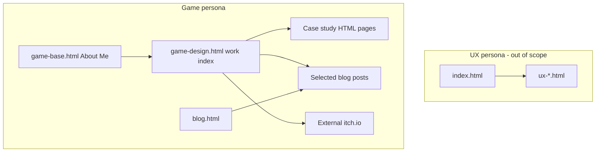

# Game portfolio architecture

Agent reference for the game half of this static portfolio.
Start from `game-design.html`.
The UX half (`index.html`, `ux-*.html`, `style.css`) is a sibling site and is out of scope for the Chinese game translation.
There is no build step, no template partials, and no existing i18n.

## How the two personas sit next to each other

`index.html` is the UX About Me hub.
`game-base.html` is the Game Design About Me hub.
They share layout ideas (hero, featured work, My Life gallery, contact, footer) but not files.
`game-base.html` uses `game-base.css` and an inline script.
It does not load `achievement.js` or `ux-interact.js`.
See `.cursor/skills/sync-game-base-with-index/SKILL.md` before porting behavior between those two hubs.

## Shared chrome

Every game page pastes the same header by hand.
The header is not a shared component.

- Logo links to `game-design.html`.
- Nav items: Game & Level Design, Blog, About Me.
- Contact block and footer are also copied per page.
- Case study pages add a back link to `game-design.html`.

A language switcher has to be inserted into each of these copies.
Shared labels (nav, buttons, contact, footer) should come from one dictionary so the copies do not drift.

## Styles and scripts

| File | Role |
| --- | --- |
| `game-base.css` | About Me theme. Defines `:root` colors and `--game-header-font` / `--game-body-font`. |
| `game-design.css` | Work index and case studies. Repeats the same font variables in its own `:root`. |
| `persona-5-x-videos.css` | Extra layout for the P5X page only. |
| `blog.css` | Blog hub and posts. Separate from the game case-study styles. |
| `script.js` | Hero rotating phrases on `game-design.html` only. Phrases are a JS array, not HTML. |
| `game-design.js` | Quest sidebar scroll, mobile mission toggle, image lightbox. Lightbox caption is English in JS. |
| Inline script in `game-base.html` | Flip cards, trophy popup, back to top. Popup copy is in the HTML. |

Header font is Rajdhani.
Body font is Sofia Sans Semi Condensed.
Neither font has Chinese glyphs.
A Chinese view needs a CJK face (for example Noto Sans SC) assigned when `html[data-lang="zh"]`, loaded after both stylesheets so the CSS variables update in one place.

## Page map

`game-design.html` is the index.
A fixed quest sidebar (`.mission-item` + `data-target`) scrolls to a matching `.game-card` id.
Sidebar names and card titles are written twice and do not always match word for word.
Translate them as one pair.

### Level Design

| Quest id | Sidebar label | Card title | Destination |
| --- | --- | --- | --- |
| project-12 | Persona 5: The Phantom X | Persona 5 The Phantom X | `persona-5-x.html` |
| project-1 | Ubisoft Level Design Competition 2024 | Ubisoft NEXT Level Design Competition 2024 | `game-project-1.html` |
| project-2 | Open World Exploration Design | Open World Exploration Gameplay Design | `perfect-world-intern.html` |
| project-9 | Ubisoft Level Design Competition 2022 | Ubisoft NEXT Level Design Competition 2022 | `next-level-2022.html` |
| project-6 | Far Cry 5 Outpost | Level Design - Far Cry 5 Outpost | `far-cry-5-out-post-level.html` |
| project-7 | Level Breakdown Framework | Level Breakdown Framework | `blog/level-breakdown.html` |

### System Design

| Quest id | Sidebar label | Card title | Destination |
| --- | --- | --- | --- |
| project-3 | Slasher Board Game | Slasher Board Game Design - Gameplay and UX Design | `board-game-ux-project.html` |
| project-14 | Apex Legends: EVO Shield and Player Engagement Breakdown | same | `blog.html` (hub, not a single post) |
| project-5 | Apex Legend System Analysis | Apex System Breakdown Analysis | `apex-analysis.html` |

### UX Design

| Quest id | Sidebar label | Card title | Destination |
| --- | --- | --- | --- |
| project-10 | UX Redesign - Tom Clancy's Splinter Cell: Blacklist | same | `game-blacklist-ux.html` |

### Other Works

| Quest id | Sidebar label | Card title | Destination |
| --- | --- | --- | --- |
| project-13 | Cut the Cheese - TOJam 2026 | Cut the Cheese | External: chensimon.itch.io |
| project-11 | Neon Jumpers | Neon Jumpers Game Design | External: anthonygunadi.itch.io |
| project-4 | Hard West 2 Walkthrough Guide | same | `game-review&guide.html` |
| project-8 | Video Game Content Creator | same | `blog/video-channel.html` |

`game-base.html` Featured Work only links to `game-project-1.html` and `persona-5-x.html`, then back to `game-design.html`.

`newproject-template.html` is an empty case-study shell.
It is not linked from the index.
Do not translate it unless a new project is created from it.

## Case study shape

Case study pages share this skeleton:

1. Pasted header nav.
2. `.project-hero` with image, `h1`, subtitle.
3. Sections of `h2` / `h3` plus paragraphs.
4. Images, some of which are the actual deliverable (layout sheets, flow charts, UI mockups).
5. Contact and footer.
6. Stylesheet is `game-design.css` only. They do not load `game-base.css`.

Approximate image counts, as a proxy for how much of the page is baked into pictures:

| Page | Images | Notes |
| --- | --- | --- |
| `perfect-world-intern.html` | 2 | Mostly HTML prose. |
| `apex-analysis.html` | 4 | Mostly HTML prose. |
| `next-level-2022.html` | 7 | Prose plus a few figures. |
| `game-blacklist-ux.html` | 7 | Mockup images carry the redesign. |
| `far-cry-5-out-post-level.html` | 10 | Mix of prose and level images. |
| `game-review&guide.html` | 12 | Article plus screenshots. |
| `board-game-ux-project.html` | 13 | Process prose plus board photos. |
| `persona-5-x.html` | 17 | Longest narrative page. Has its own video stylesheet. |
| `game-project-1.html` | 37 | Level document, beat sheet, and flow chart are images. |

Lightbox caption text lives in `game-design.js` (`Image N of M - Use mouse wheel to zoom`).

## Where English lives

- Visible copy is hardcoded in each HTML file.
- Hero rotator phrases live in `script.js`.
- Trophy and flip-card strings live in `game-base.html`.
- `alt` text, `title`, meta description, and `aria-label` are English too.
- Many figures have English typeset inside the image file.
- Swapping `lang` on `<html>` does not translate any of this.
- itch.io pages cannot be translated from this repo.
- Official game titles, studio names, and mechanic names should stay consistent across sidebar, card, and case study.

## Boundary for the Chinese pass

In scope, decided with Mark on 2026-10-02.
Status as of 2026-10-02: **implemented** on all pages below (paired `.lang-en` / `.lang-zh`, shared switcher, system-language first visit).

- `game-design.html`
- `game-base.html`
- The case study HTML files in the tables above. External itch.io pages stay as links. Only the card blurbs are translated.
- `blog.html` plus the five live posts: `level-breakdown.html`, `max-payne3-analysis.html`, `video-channel.html`, `apex-design-part1-badges-legends-loot.html`, `apex-design-part2-ttk-evolving-shield.html`.
- `blog/blog-template.html` stays English. It is an empty shell.

Still out of scope:

- `index.html` and the UX case studies.

Language behavior, also decided:

- A header control switches English and Chinese on the same URL.
- The choice is stored in `localStorage` and always wins over the browser.
- First visit only: if `navigator.language` starts with `zh`, open in Chinese. Otherwise open in English.
- Simplified Chinese only. `zh-TW` and `zh-HK` use the same simplified copy.
- Game titles and company names use official Chinese names.
- Confirmed glossary (2026-10-02) is below. Later pages must reuse these words.

A later translation should treat sidebar label and card title as one string pair, and should not introduce a static-site generator just to share the header.

Visible copy on a translated page is paired in the HTML: `.lang-en` and `.lang-zh`.
`i18n-boot.js` sets `html[data-lang]` before paint.
`i18n.css` hides the inactive language and swaps in Noto Sans SC.
`i18n-switch.js` writes `localStorage` only after a click.
`script.js` hero phrases and `game-design.js` lightbox captions read the current language.

## Confirmed glossary

Use these Chinese names exactly.

- Persona 5: The Phantom X: 女神异闻录：夜幕魅影
- Far Cry 5: 孤岛惊魂5
- A Far Cry outpost made in the level editor is a 哨站, not a game title.
- Apex Legends: Apex英雄
- EVO Shield: 进化甲
- Tom Clancy's Splinter Cell: Blacklist: 细胞分裂：黑名单
- Max Payne 3: 马克思·佩恩3
- Hard West 2: 血战西部2
- Spiritfarer: 灵魂摆渡人
- Sleeping Dogs: 热血无赖
- PUBG: 绝地求生
- Overwatch: 守望先锋
- Ubisoft: 育碧
- Ubisoft NEXT: 育碧 NEXT
- Perfect World: 完美世界
- Black Wings Studio: 黑羽工作室
- Perfect World 7th Project Team: 完美世界 第七项目组
- University of Toronto: 多伦多大学
- UCG (Ultra Console Game): UCG（游戏机实用技术）
- Atlas Japan: 日本阿特拉斯
- TOJam: 多伦多 Game Jam
- Do not translate Game Jam as 果酱. Keep the English words Game Jam.
- Slasher, Cut the Cheese, and Neon Jumpers stay in English.
- Creative Instinct: 杀手灵感
- 360 Approach: 360度探索设计方式
- greybox and blockout are both 白盒.
- affordance: 功能可供性
- Shimotsuna: 下津名高美
- Girl's Room: 少女房间
- Private Domain: 私人领域
- pillar experience: 体验支柱
- beat: 节拍
- pacing: 节奏
- traversal and flow: 动线
- TTK on first mention: 击杀时间（TTK）. Later mentions can stay TTK.
- Personal names stay in their original spelling, including Xinglong Zhou and Jason McCord.
